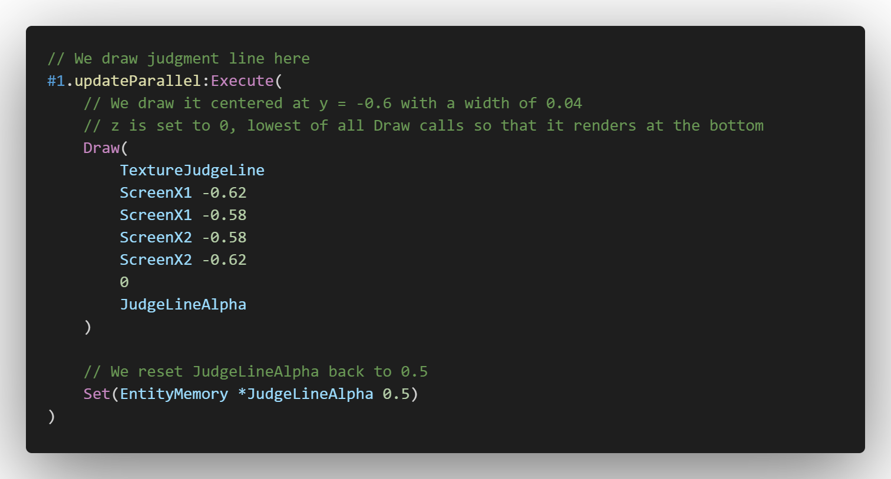

# VSCode SIL

Unofficial VSCode language extension for the
[Sonolus Intermediate Language](https://github.com/NonSpicyBurrito/sonolus-wiki/wiki/Sonolus-Intermediate-Language)

## Features

  - Syntax highlighting for Sonolus Intermediate Language scripts

## Setup

### Local Install
  - Copy repo folder into <user home>/.vscode/extensions
  - Restart VS Code
